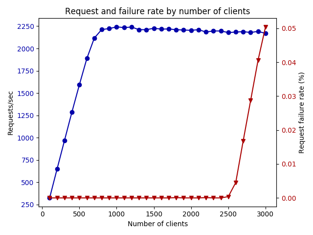

# Tendermint Load Testing

This folder contains experimental results using the following parameters.

| Parameter | Description/Value |
| --- | --- |
| Tendermint version | v0.29.1 |
| Proxy app | `kvstore` |
| Network configuration | `003-no-mempool` |
| Tendermint nodes | 4 |
| Load test nodes | 4 |
| Protocol | HTTP |
| RPCs used | `broadcast_tx_sync`, `abci_query` |
| Starting clients | 100 |
| Ending clients | 3000 |
| Execution time | 10 min per load |
| Redeploy network between tests | Yes |

## Results




## Configuration

```toml
# This is a TOML config file.
# For more information, see https://github.com/toml-lang/toml

##### main base config options #####

# TCP or UNIX socket address of the ABCI application,
# or the name of an ABCI application compiled in with the Tendermint binary
proxy_app = "kvstore"

# A custom human readable name for this node
moniker = "tik0"

# If this node is many blocks behind the tip of the chain, FastSync
# allows them to catchup quickly by downloading blocks in parallel
# and verifying their commits
fast_sync = true

# Database backend: leveldb | memdb | cleveldb
db_backend = "leveldb"

# Database directory
db_dir = "data"

# Output level for logging, including package level options
log_level = "main:info,state:info,*:error"

# Output format: 'plain' (colored text) or 'json'
log_format = "json"

##### additional base config options #####

# Path to the JSON file containing the initial validator set and other meta data
genesis_file = "config/genesis.json"

# Path to the JSON file containing the private key to use as a validator in the consensus protocol
priv_validator_key_file = "config/priv_validator_key.json"

# Path to the JSON file containing the last sign state of a validator
priv_validator_state_file = "data/priv_validator_state.json"

# TCP or UNIX socket address for Tendermint to listen on for
# connections from an external PrivValidator process
priv_validator_laddr = ""

# Path to the JSON file containing the private key to use for node authentication in the p2p protocol
node_key_file = "config/node_key.json"

# Mechanism to connect to the ABCI application: socket | grpc
abci = "socket"

# TCP or UNIX socket address for the profiling server to listen on
prof_laddr = ""

# If true, query the ABCI app on connecting to a new peer
# so the app can decide if we should keep the connection or not
filter_peers = false

##### advanced configuration options #####

##### rpc server configuration options #####
[rpc]

# TCP or UNIX socket address for the RPC server to listen on
laddr = "tcp://0.0.0.0:26657"

# A list of origins a cross-domain request can be executed from
# Default value '[]' disables cors support
# Use '["*"]' to allow any origin
cors_allowed_origins = []

# A list of methods the client is allowed to use with cross-domain requests
cors_allowed_methods = ["HEAD", "GET", "POST", ]

# A list of non simple headers the client is allowed to use with cross-domain requests
cors_allowed_headers = ["Origin", "Accept", "Content-Type", "X-Requested-With", "X-Server-Time", ]

# TCP or UNIX socket address for the gRPC server to listen on
# NOTE: This server only supports /broadcast_tx_commit
grpc_laddr = ""

# Maximum number of simultaneous connections.
# Does not include RPC (HTTP&WebSocket) connections. See max_open_connections
# If you want to accept a larger number than the default, make sure
# you increase your OS limits.
# 0 - unlimited.
# Should be < {ulimit -Sn} - {MaxNumInboundPeers} - {MaxNumOutboundPeers} - {N of wal, db and other open files}
# 1024 - 40 - 10 - 50 = 924 = ~900
grpc_max_open_connections = 900

# Activate unsafe RPC commands like /dial_seeds and /unsafe_flush_mempool
unsafe = false

# Maximum number of simultaneous connections (including WebSocket).
# Does not include gRPC connections. See grpc_max_open_connections
# If you want to accept a larger number than the default, make sure
# you increase your OS limits.
# 0 - unlimited.
# Should be < {ulimit -Sn} - {MaxNumInboundPeers} - {MaxNumOutboundPeers} - {N of wal, db and other open files}
# 1024 - 40 - 10 - 50 = 924 = ~900
max_open_connections = 900

##### peer to peer configuration options #####
[p2p]

# Address to listen for incoming connections
laddr = "tcp://0.0.0.0:26656"

# Address to advertise to peers for them to dial
# If empty, will use the same port as the laddr,
# and will introspect on the listener or use UPnP
# to figure out the address.
external_address = ""

# Comma separated list of seed nodes to connect to
seeds = ""

# Comma separated list of nodes to keep persistent connections to
persistent_peers = "515eb847e7068d464abf98847efdf6349e89ec13@tik0.sredev.co:26656,91c5dd314d27cc8194c60f1826c0b636170d8a5e@tik1.sredev.co:26656,c619e09a731f3881544bffe448cae73525b54612@tik2.sredev.co:26656,e14f6347faff2660a0c36c275c578ade93ad2c19@tik3.sredev.co:26656"

# UPNP port forwarding
upnp = false

# Path to address book
addr_book_file = "config/addrbook.json"

# Set true for strict address routability rules
# Set false for private or local networks
addr_book_strict = false

# Maximum number of inbound peers
max_num_inbound_peers = 40

# Maximum number of outbound peers to connect to, excluding persistent peers
max_num_outbound_peers = 10

# Time to wait before flushing messages out on the connection
flush_throttle_timeout = "100ms"

# Maximum size of a message packet payload, in bytes
max_packet_msg_payload_size = 1024

# Rate at which packets can be sent, in bytes/second
send_rate = 5120000

# Rate at which packets can be received, in bytes/second
recv_rate = 5120000

# Set true to enable the peer-exchange reactor
pex = true

# Seed mode, in which node constantly crawls the network and looks for
# peers. If another node asks it for addresses, it responds and disconnects.
#
# Does not work if the peer-exchange reactor is disabled.
seed_mode = false

# Comma separated list of peer IDs to keep private (will not be gossiped to other peers)
private_peer_ids = ""

# Toggle to disable guard against peers connecting from the same ip.
allow_duplicate_ip = true

# Peer connection configuration.
handshake_timeout = "20s"
dial_timeout = "3s"

##### mempool configuration options #####
[mempool]

recheck = false
broadcast = false
wal_dir = ""

# size of the mempool
size = 5000

# size of the cache (used to filter transactions we saw earlier)
cache_size = 10000

##### consensus configuration options #####
[consensus]

wal_file = "data/cs.wal/wal"

timeout_propose = "3s"
timeout_propose_delta = "500ms"
timeout_prevote = "1s"
timeout_prevote_delta = "500ms"
timeout_precommit = "1s"
timeout_precommit_delta = "500ms"
timeout_commit = "1s"

# Make progress as soon as we have all the precommits (as if TimeoutCommit = 0)
skip_timeout_commit = false

# EmptyBlocks mode and possible interval between empty blocks
create_empty_blocks = false
create_empty_blocks_interval = "0s"

# Reactor sleep duration parameters
peer_gossip_sleep_duration = "100ms"
peer_query_maj23_sleep_duration = "2s"

# Block time parameters. Corresponds to the minimum time increment between consecutive blocks.
blocktime_iota = "1s"

##### transactions indexer configuration options #####
[tx_index]

# What indexer to use for transactions
#
# Options:
#   1) "null"
#   2) "kv" (default) - the simplest possible indexer, backed by key-value storage (defaults to levelDB; see DBBackend).
indexer = "kv"

# Comma-separated list of tags to index (by default the only tag is "tx.hash")
#
# You can also index transactions by height by adding "tx.height" tag here.
#
# It's recommended to index only a subset of tags due to possible memory
# bloat. This is, of course, depends on the indexer's DB and the volume of
# transactions.
index_tags = ""

# When set to true, tells indexer to index all tags (predefined tags:
# "tx.hash", "tx.height" and all tags from DeliverTx responses).
#
# Note this may be not desirable (see the comment above). IndexTags has a
# precedence over IndexAllTags (i.e. when given both, IndexTags will be
# indexed).
index_all_tags = false

##### instrumentation configuration options #####
[instrumentation]

# When true, Prometheus metrics are served under /metrics on
# PrometheusListenAddr.
# Check out the documentation for the list of available metrics.
prometheus = true

# Address to listen for Prometheus collector(s) connections
prometheus_listen_addr = ":26660"

# Maximum number of simultaneous connections.
# If you want to accept a larger number than the default, make sure
# you increase your OS limits.
# 0 - unlimited.
max_open_connections = 3

# Instrumentation namespace
namespace = "tendermint"
```
