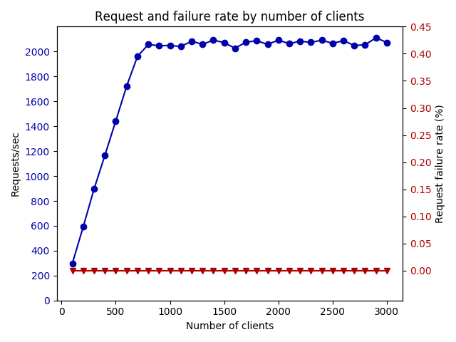

# Tendermint v0.28.0 Load Testing

This folder contains experimental results using the following parameters.

| Parameter | Description/Value |
| --- | --- |
| Tendermint version | v0.28.0 |
| Proxy app | `kvstore` |
| Network configuration | `002-no-empty-blocks-issue` |
| Tendermint nodes | 4 |
| Load test nodes | 4 |
| Protocol | HTTP |
| RPCs used | `broadcast_tx_sync`, `abci_query` |
| Starting clients | 100 |
| Ending clients | 3000 |
| Execution time | 1 min per load |
| Redeploy network between tests | No (cumulative) |

## Results

