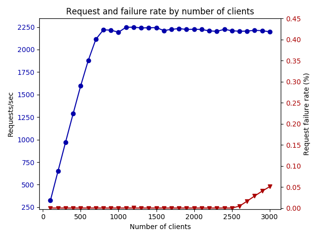
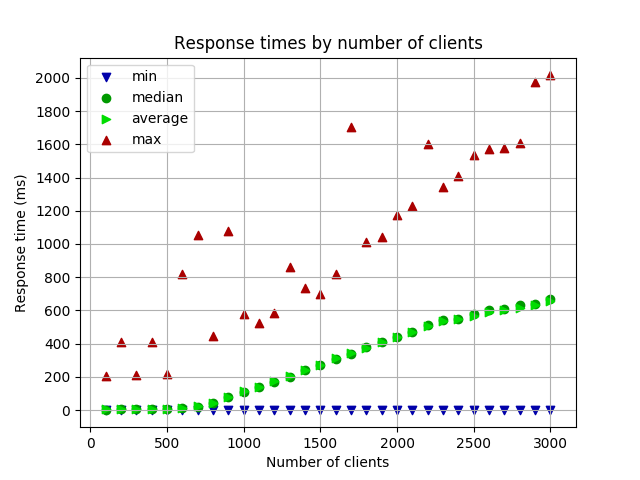

# Tendermint v0.28.0 Load Testing

This folder contains experimental results using the following parameters.

| Parameter | Description/Value |
| --- | --- |
| Tendermint version | v0.28.0 |
| Proxy app | `kvstore` |
| Network configuration | `002-no-empty-blocks-issue` |
| Starting clients | 100 |
| Ending clients | 3000 |
| Execution time | 10 mins per load |
| Redeploy network between tests | Yes |

## Results

